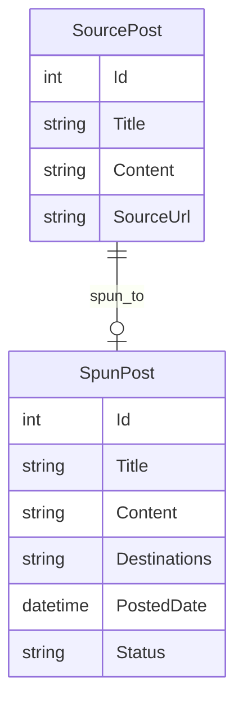

# BlogPost

**BlogPost** is an ASP.NET/C# project that automates the process of fetching posts from a WordPress website (using the WordPress API), rewrites the content using the Spin Writer API, and then reposts the spun content to multiple WordPress websites and Blogger blogs. This tool is ideal for content syndication, network posting, or managing multiple blogs with unique, SEO-friendly variations of original articles.

---

## Features

- **Fetch Posts from WordPress:** Connects to any WordPress site via the WordPress REST API to retrieve post content.
- **Spin Content with Spin Writer API:** Integrates with Spin Writer to automatically rewrite the title and content for uniqueness and SEO.
- **Post to Multiple WordPress Sites:** Publishes spun posts to other WordPress sites using their APIs.
- **Post to Blogger:** Publishes spun content to Blogger blogs via the Blogger API.
- **Automated Workflow:** End-to-end automation from fetching to spinning to posting.
- **Error Handling & Logging:** Tracks status and errors for each API interaction.

---

## Technologies Used

- **ASP.NET Web Forms / C#:** Core application logic and web interface.
- **WordPress REST API:** For fetching and posting content to WordPress sites.
- **Spin Writer API:** For rewriting content automatically.
- **Blogger API:** For posting spun content to Blogger.
- **Newtonsoft.Json:** For JSON serialization/deserialization.
- **HttpClient:** For REST API communication.

---

## Typical Workflow

1. **Authenticate:** Configure credentials for WordPress, Spin Writer, and Blogger APIs.
2. **Fetch Original Post:** Use WordPress API to get the post's title and content.
3. **Spin/Re-write Content:** Pass fetched data to Spin Writer API, receive spun title and content.
4. **Post to Destinations:** Publish spun content to other WordPress sites and Blogger blogs.
5. **Logging & Status:** Application logs all operations, API responses, and errors.

---

## Example Code Snippet

```csharp
// Fetch post from WordPress
using (var client = new HttpClient())
{
    var wpResponse = await client.GetStringAsync("https://sourcewp.com/wp-json/wp/v2/posts/POST_ID");
    var post = JsonConvert.DeserializeObject<WordPressPost>(wpResponse);

    // Spin title and content with Spin Writer API
    var spinRequest = new { text = post.content.rendered, title = post.title.rendered };
    // Call Spin Writer API here...

    // Post to another WordPress site
    var spunPost = new { title = spunTitle, content = spunContent };
    var wpPostContent = new StringContent(JsonConvert.SerializeObject(spunPost), Encoding.UTF8, "application/json");
    var wpPostResponse = await client.PostAsync("https://targetwp.com/wp-json/wp/v2/posts", wpPostContent);

    // Post to Blogger
    // Call Blogger API with spun content...
}
```

---

## Data Model (ER Diagram Example)



---

## Getting Started

1. Clone the repository.
2. Set up API credentials for WordPress, Spin Writer, and Blogger.
3. Configure source and destination sites in your ASP.NET application settings.
4. Run the application and use the UI or endpoints to automate the workflow.

---

## License

This project uses open-source libraries (`Newtonsoft.Json`, etc.) and external APIs (WordPress, Spin Writer, Blogger).
See individual library and API documentation for licensing details.

---

## Author

Ashish Saurav

---

## Contributing

Pull requests, feature suggestions, and bug reports are welcome.
